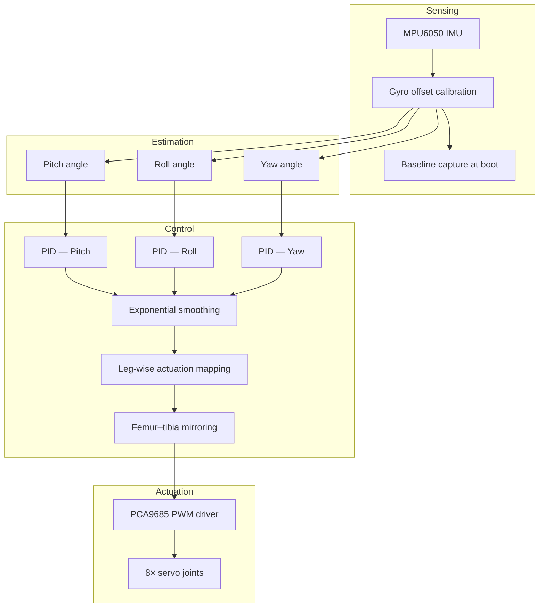

# Research Overview

**Repository:** [q8-quadruped-imu-stabilization](https://github.com/romil0001/q8-quadruped-imu-stabilization)  
**Platform:** Rombotics Q8 — low-cost 8-DOF quadruped testbed  
**Primary contribution:** Open, reproducible firmware for IMU-driven static pose stabilization on a four-legged servo platform

---

## Abstract

This repository documents the design, implementation, and iterative evaluation of a **static stabilization controller** for a quadruped robot with eight independent servo joints (two per leg). Orientation is estimated with an **MPU6050** inertial measurement unit (IMU). Corrective torques are applied through a **PCA9685** PWM driver using a **decoupled three-axis PID** architecture (pitch, roll, yaw).

The research progresses from open-loop joint calibration and single-leg experiments to full-body, eight-degree-of-freedom control with **proportional mirroring** of antagonistic femur–tibia joint pairs. Each firmware sketch corresponds to a documented experimental phase, enabling traceability from hypothesis to implementation.

---

## Research Problem

Quadruped robots must maintain orientation when subjected to external disturbances or internal actuator errors. Commercial platforms rely on expensive actuators, custom electronics, and proprietary control stacks. This work investigates:

1. **Can a low-cost, 8-servo quadruped achieve static pose recovery using only an IMU and PID feedback?**
2. **How should corrective commands be distributed across four legs and eight joints?**
3. **What calibration and signal-conditioning steps are required for reproducible results on commodity hardware?**

The Q8 platform constrains the problem to **quasi-static balancing** (standing pose correction) rather than dynamic locomotion, isolating the sensing and control layers for systematic study.

---

## System Architecture



### Hardware platform

| Subsystem | Component | Specification |
|-----------|-----------|---------------|
| Compute | ESP32 / Teensy 4.0 | Sketch-dependent; BalancePID targets ESP32 |
| Proprioception | MPU6050 | 6-axis IMU, I2C @ 400 kHz |
| Actuation interface | PCA9685 | 16-channel PWM, I2C address 0x40 |
| Joints | 8× RC servos | 2 per leg: femur (top) + tibia (bottom) |
| Optional | 4× NEMA 17 steppers | Shoulder actuation experiments |

### Software stack

| Layer | Implementation | Location |
|-------|----------------|----------|
| Final controller | 3-axis PID + smoothing + mirroring | `BalancePID/` |
| Calibration toolchain | Serial CLI servo characterization | `Calibrate/` |
| Pose presets | Open-loop home / tallest / shortest | `Home_position/`, etc. |
| Platform baseline | Nova Spot-Micro clone v5.1 | `NovaSM3/` |
| Dependencies | Vendored Arduino libraries | `libraries/` |

---

## Research Contributions

1. **Modular experimental pipeline** — Firmware sketches are organized as sequential research phases (calibration → single-leg → multi-axis PID → full 8-DOF), supporting reproducible iteration.

2. **Decoupled 3-axis PID with leg-wise mapping** — Independent pitch, roll, and yaw controllers produce corrective offsets that are combined per leg using a fixed sign pattern derived from quadruped kinematics.

3. **Proportional femur–tibia mirroring** — Bottom joints follow top joints through a piecewise-linear mapping (`computeBottomPWM`), preserving antagonistic coupling without full inverse kinematics.

4. **Boot-time IMU calibration protocol** — Automatic gyro offset estimation plus baseline orientation capture eliminates manual zeroing and supports repeatability across power cycles.

5. **Open artifact release** — Complete source code, calibration tools, parameter files, and documentation for independent verification.

---

## Control Formulation (Summary)

Full derivation: [METHODOLOGY.md](METHODOLOGY.md).

At each control cycle \(k\):

\[
e_{\phi} = 0 - \phi_k, \quad e_{\theta} = 0 - \theta_k, \quad e_{\psi} = 0 - \psi_k
\]

where \(\phi\), \(\theta\), \(\psi\) are baseline-adjusted pitch, roll, and yaw.

Each axis uses a discrete PID:

\[
u_{\phi} = K_p e_{\phi} + K_i \int e_{\phi}\, dt + K_d \frac{de_{\phi}}{dt}
\]

Outputs are exponentially smoothed, then mapped to four femur servos with leg-specific sign conventions. Tibia servos receive mirrored commands via `computeBottomPWM`.

---

## Experimental Phases

| Phase | Sketch | Research question |
|-------|--------|-------------------|
| 0 | `Calibrate/`, `Home_position/` | What are the safe operating limits of each joint? |
| 1 | `Mpu_one_leg_success/` | Can IMU feedback stabilize a single leg? |
| 2 | `servowithmpu/`, `tiltwithservo/` | Does direct tilt-to-PWM mapping suffice? |
| 3 | `Trail/` | Is 4-DOF (femur-only) PID sufficient? |
| 4 | `stablisingrobot/`, `stablisingrobotpid/` | Do hybrid servo + stepper actuators improve correction? |
| 5 | **`BalancePID/`** | Does full 8-DOF with mirroring improve stability? |
| 6 | `NovaSM3/` | Can stabilization integrate with a full locomotion platform? |

Detailed protocols: [EXPERIMENTS.md](EXPERIMENTS.md).

---

## Documenting Results

Use the following template when recording experimental outcomes (thesis chapter, lab notebook, or publication):

```markdown
### Experiment: [Phase name]
- **Date:**
- **Firmware:** [sketch + commit hash]
- **PID gains:** [kp, ki, kd per axis]
- **Disturbance:** [manual push / payload / incline angle]
- **Metric:** [max tilt before loss of stability, settling time, RMS error]
- **Outcome:** [stable / marginally stable / unstable]
- **Notes:**
```

Enable CSV serial logging in `BalancePID/pid_config.h` (`RESEARCH_LOG 1`) to capture time-series data for post-processing in MATLAB, Python, or R.

---

## Related Documentation

| Document | Contents |
|----------|----------|
| [METHODOLOGY.md](METHODOLOGY.md) | Control theory, calibration protocol, tuning procedure |
| [EXPERIMENTS.md](EXPERIMENTS.md) | Phase-by-phase experimental design |
| [REPRODUCIBILITY.md](REPRODUCIBILITY.md) | Step-by-step replication guide |
| [REFERENCES.md](REFERENCES.md) | Bibliography and prior art |
| [SKETCHES.md](SKETCHES.md) | Firmware catalog |

---

## Citation

If you use this repository in academic work, cite it using [CITATION.cff](../CITATION.cff) or:

```bibtex
@software{q8_quadruped_imu_stabilization_2026,
  author    = {romil0001},
  title     = {Rombotics Q8: IMU-Based Static Stabilization for a Low-Cost Quadruped},
  year      = {2026},
  url       = {https://github.com/romil0001/q8-quadruped-imu-stabilization},
  version   = {1.0.0}
}
```

---

## Future Work

- Integral windup clamping and anti-windup for sustained disturbances
- Kalman or complementary filter fusion for improved angle estimation
- Model-based inverse kinematics replacing heuristic mirroring
- Dynamic stability: extending from quasi-static to walking gaits
- Formal comparison against LQR or model predictive control (MPC) baselines
